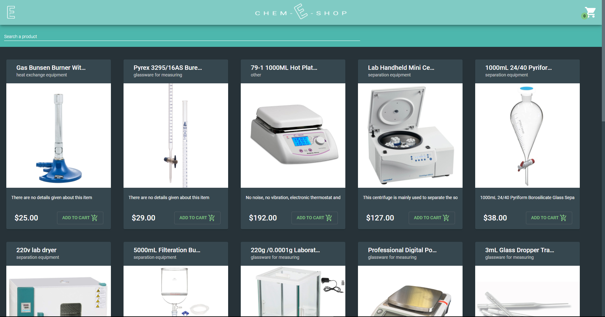
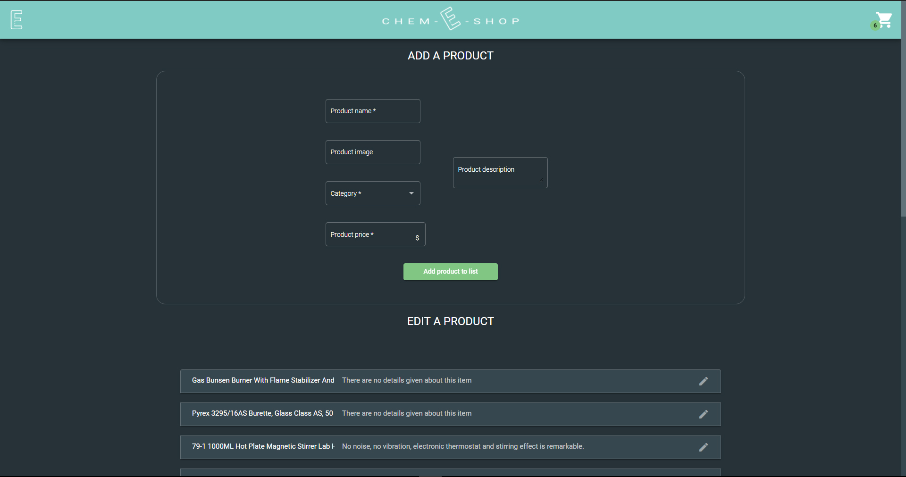

# [Chem-E-Shop](https://chem-e-shop.web.app)

An e-commerce website where buy equipment for chem labs. Visit the preview [here](https://chem-e-shop.web.app)

## Overview

## Before start

This project was generated with [Angular CLI](https://github.com/angular/angular-cli) version 10.1.6.

Make sure you have npm and Angular CLI installed. To Install Angular CLI, oopen a terminal and run `npm install -g @angular/cli`.
If you clone this app run `npm i` to install all dependencies needed for the project. After that you can run this app locally using `ng serve` command.
To have more information about angular basic commands, [read here](#angular-base-commands)

## General information

### Features

Chem-E-Shop is an e-commerce website built with Angular. It has a cards layout dashboard that displays all the products to buy stored in the database. It uses cloud firestore for
local storage.
You can easily search for a product with the search bar, add products to cart and viewing cart with a really user-friendly layout.
Clicking on a product title will show you more details about the product and a bigger image preview.

### Deployed on Firebase

The app is deployed on firebase.
To getting started with firebase install firebase globally using the command `npm install -g firebase-tools`.
After building the project you can deploy it using `ng deploy` command.

### Aesthetic and graphic features powered by Angular Material

Dialog, snackbars, cards and button are powered by Angular Material. It gives to the website a very modern and flat appearance.
Visit [this](https://material.angular.io/guide/getting-started) to get started with angular material.
Visit [this](https://material.angular.io/components/categories) to look at the components used in the app.

## Angular base commands

Basic commands to run the app and creating new component are given below.

### Development server

Run `ng serve` for a dev server. Navigate to `http://localhost:4200/`. The app will automatically reload if you change any of the source files.

### Code scaffolding

Run `ng generate component component-name` to generate a new component. You can also use `ng generate directive|pipe|service|class|guard|interface|enum|module`.

### Build

Run `ng build` to build the project. The build artifacts will be stored in the `dist/` directory. Use the `--prod` flag for a production build.

### Running unit tests

Run `ng test` to execute the unit tests via [Karma](https://karma-runner.github.io).

### Running end-to-end tests

Run `ng e2e` to execute the end-to-end tests via [Protractor](http://www.protractortest.org/).

### Further help

To get more help on the Angular CLI use `ng help` or go check out the [Angular CLI README](https://github.com/angular/angular-cli/blob/master/README.md).
